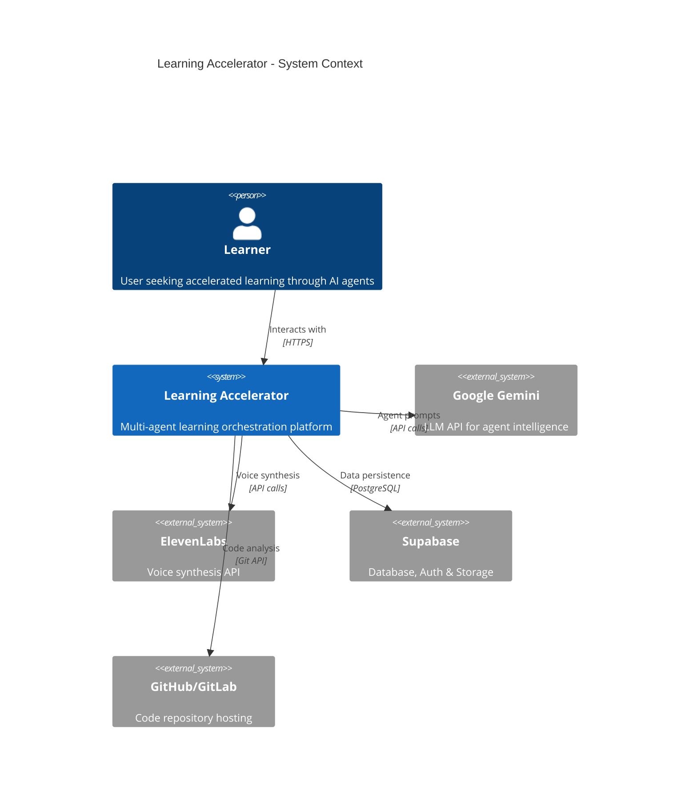
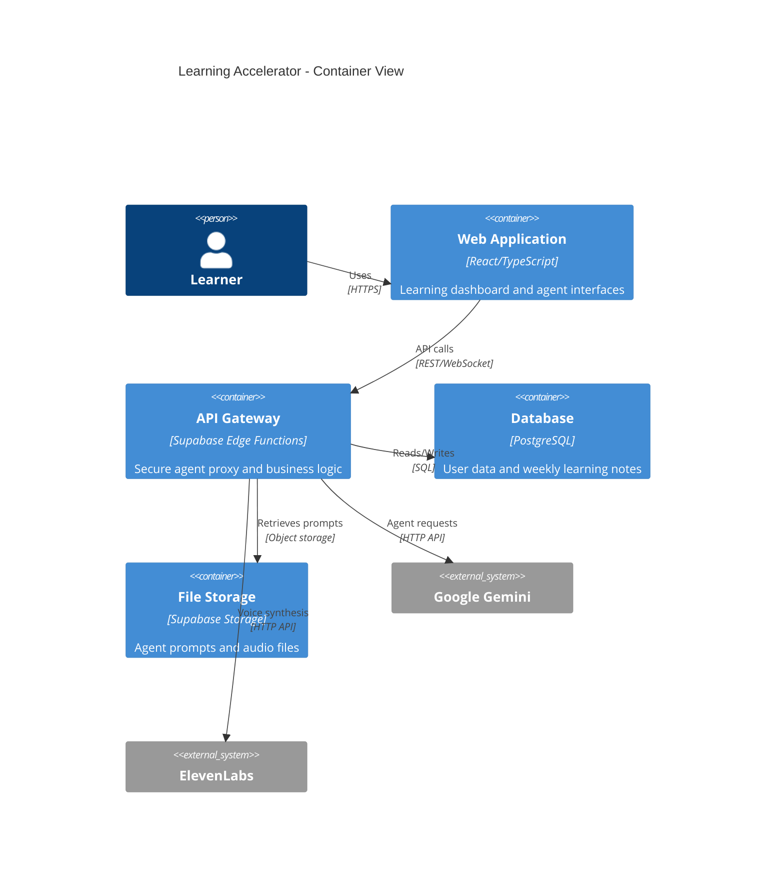
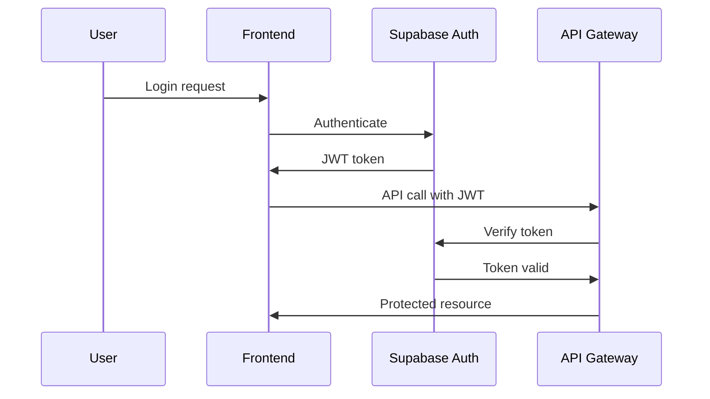

# System Architecture - Learning Accelerator

## C4 System Context Diagram

## C4 Container Diagram

## Component Architecture

### Frontend Components
- **Dashboard Module**: Main learning interface with agent cards
- **Agent Interaction Module**: Chat interfaces and voice controls  
- **Progress Module**: Weekly tracking and analytics
- **Auth Module**: Login, registration, and session management

### Backend Services
- **Agent Proxy Service**: Secure API key management and prompt injection
- **Authentication Service**: JWT handling and user management
- **Database Service**: Weekly JSON persistence with versioning
- **Voice Service**: ElevenLabs integration and audio caching

### Data Flow

1. **User Authentication**: Supabase Auth → JWT tokens → Protected routes
2. **Agent Interaction**: Frontend → API Gateway → Prompt injection → Gemini API
3. **Voice Synthesis**: Agent response → ElevenLabs API → Audio URL → Frontend playback
4. **Data Persistence**: Structured JSON → PostgreSQL → Historical tracking

## Security Architecture

### Authentication Flow

### Agent Proxy Security
- API keys stored server-side only
- Prompts never exposed to client
- Rate limiting on agent endpoints
- Input validation and sanitization

## Scalability Considerations

- **Horizontal Scaling**: Stateless API design enables load balancing
- **Caching Strategy**: Agent responses cached for performance
- **Database Optimization**: Indexed queries and connection pooling
- **CDN Integration**: Static assets and audio files served via CDN