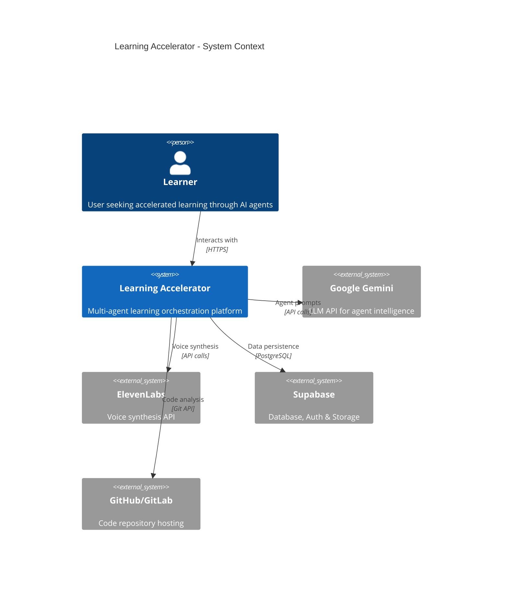
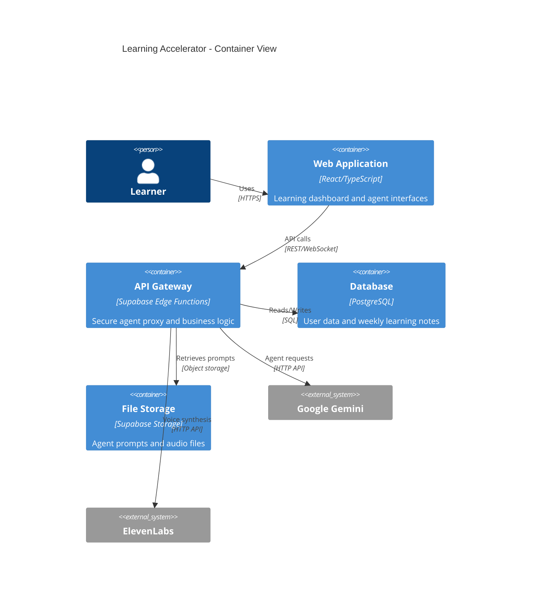
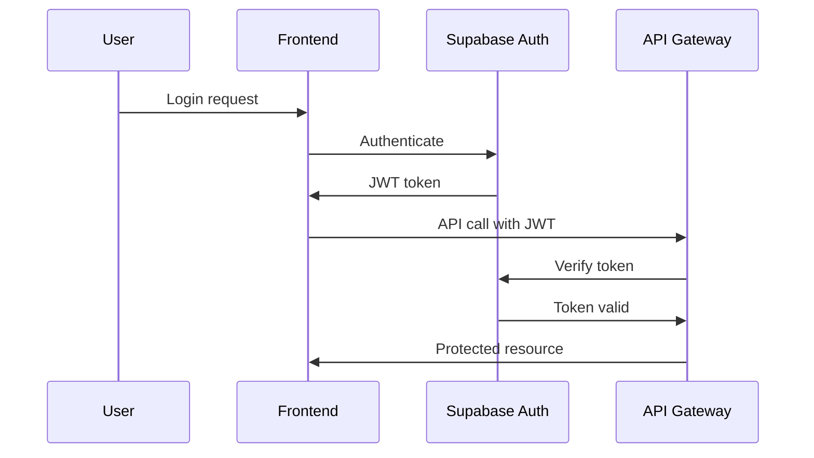

# System Architecture - Learning Accelerator

## C4 System Context Diagram

## C4 Container Diagram

## Component Architecture

### Frontend Components
- **Dashboard Module**: Main learning interface with agent cards
- **Agent Interaction Module**: Chat interfaces and voice controls  
- **Progress Module**: Weekly tracking and analytics
- **Auth Module**: Login, registration, and session management

### Backend Services
- **Agent Proxy Service**: Secure API key management and prompt injection
- **Authentication Service**: JWT handling and user management
- **Database Service**: Weekly JSON persistence with versioning
- **Voice Service**: ElevenLabs integration and audio caching

### AI Agent Ecosystem - Instructor-Centric Learning Flow

#### Core Learning Agents (Instructor-Centric Flow)
- **Instructor Agent**: **Central teacher** - delivers structured lectures, checks comprehension, prepares for practice
- **CLO Agent**: Curriculum architect - creates weekly learning frameworks
- **TA Agent**: Hands-on coding coach - receives instructor-modified prompts for targeted practice
- **Socratic Agent**: Question-based facilitator - receives instructor-modified prompts for concept mastery
- **Alex Agent**: Technical assessor - grades weekly tasks and provides feedback to CLO

#### Support Agents (Ad-hoc Mode)
- **Onboarder Agent**: User onboarding and profile setup
- **Clarifier Agent**: Goal clarification and intent creation
- **Career Match Agent**: Job matching and skill gap analysis (Premium)
- **Portfolio Curator**: Portfolio site generation and management (Premium)
- **Brand Strategist**: Content and career development (Premium)

### Learning Flow Architecture

#### Daily Learning Flow
1. **Lecture Phase**: Instructor delivers structured content from CLO framework
2. **Comprehension Check**: Instructor asks questions to gauge understanding
3. **Practice Preparation**: Instructor modifies TA/Socratic prompts based on comprehension
4. **Practice Sessions**: User chooses TA (coding) or Socratic (questioning) with tailored prompts

#### Unified Education Agent UI and Coding Workspace

- **Education Agent (UI)**: A single unified surface that orchestrates all agents as internal tools. The UI presents a timeline of phases (Plan → Lecture → Check → Practice → Reflect) and embeds structured outputs (lecture blocks, questions, coding tasks, reviews) in one conversation-like experience.
- **Tool Registry (Server-only)**: Wraps all existing agents (CLO, Instructor, TA, Socratic, Alex, Brand, etc.) behind typed tool calls with strict input/output contracts and ETag-based caching.
- **Coding Workspace (Tool)**: A dedicated, in-browser coding environment (file tree + Monaco editor + runner) used when practice focuses on coding. TA provides scaffolding/hints/fixes; Alex performs pre/final reviews with rubric scoring. The Education Agent calls this tool with focus areas and instructor notes.

#### Weekly Assessment Loop
1. **Alex Assessment**: Grades weekly project submissions
2. **CLO Adjustment**: Modifies next week's curriculum based on Alex feedback
3. **Curriculum Evolution**: Learning objectives adapt to user progress

#### Data Flow

1. **User Authentication**: Supabase Auth → JWT tokens → Protected routes
2. **Instructor-Centric Learning**: CLO → Instructor → Modified Prompts → TA/Socratic
3. **Agent Interaction**: Frontend → API Gateway → Prompt injection → Gemini API
4. **Voice Synthesis**: Agent response → ElevenLabs API → Audio URL → Frontend playback
5. **Data Persistence**: Structured JSON → PostgreSQL → Historical tracking
6. **Feedback Loops**: Daily practice results → Instructor, Weekly assessments → CLO

## Security Architecture

### Authentication Flow

### Agent Proxy Security
- API keys stored server-side only
- Prompts never exposed to client
- Rate limiting on agent endpoints
- Input validation and sanitization

## Scalability Considerations

- **Horizontal Scaling**: Stateless API design enables load balancing
- **Caching Strategy**: Agent responses cached for performance
- **Database Optimization**: Indexed queries and connection pooling
- **CDN Integration**: Static assets and audio files served via CDN