# Wisely - Entity Relationship Diagram

## Database Relationships Overview

```mermaid
erDiagram
    users ||--o{ weeks : "has many"
    users ||--o{ socratic_sessions : "has many"
    users ||--o{ kpi_metrics : "has many"
    users ||--o{ reviews : "has many"
    users ||--o{ subscriptions : "has many"
    users ||--o{ payment_events : "has many"
    
    weeks ||--o{ clo_notes : "has many"
    weeks ||--o{ engineer_notes : "has many"
    weeks ||--o{ socratic_sessions : "has many"
    weeks ||--o{ brand_packages : "has many"
    weeks ||--o{ kpi_metrics : "has many"
    weeks ||--o{ reviews : "has many"
    weeks ||--o{ jobs : "has many"
    
    socratic_sessions ||--o{ messages : "has many"
    socratic_sessions ||--o{ agent_assignments : "has many"
    
    plans ||--o{ subscriptions : "has many"
    subscriptions ||--o{ invoices : "has many"
    
    agents ||--o{ agent_assignments : "has many"
    jobs ||--o{ agent_assignments : "has many"
    weeks ||--o{ agent_assignments : "has many"
    
    users {
        uuid id PK
        varchar email UK
        varchar name
        user_role role
        varchar avatar_url
        varchar voice_preference
        jsonb learning_preferences
        timestamptz last_active
        timestamptz created_at
        timestamptz updated_at
    }
    
    agents {
        uuid id PK
        agent_type type
        varchar name
        text description
        jsonb config
        boolean is_active
        varchar version
        timestamptz created_at
        timestamptz updated_at
    }
    
    weeks {
        uuid id PK
        uuid user_id FK
        integer week_number
        date start_date
        date end_date
        week_status status
        varchar focus_area
        integer estimated_hours
        integer actual_hours
        integer completion_percentage
        timestamptz created_at
        timestamptz updated_at
    }
    
    clo_notes {
        uuid id PK
        uuid week_id FK
        varchar module_title
        text[] learning_objectives
        text[] key_concepts
        integer estimated_duration
        text[] prerequisites
        jsonb resources
        text[] assessment_criteria
        jsonb content
        timestamptz created_at
        timestamptz updated_at
    }
    
    engineer_notes {
        uuid id PK
        uuid week_id FK
        text repository_url
        text analysis_summary
        integer code_quality_score
        jsonb recommendations
        jsonb technical_debt_items
        text[] best_practices_followed
        text[] areas_for_improvement
        jsonb content
        timestamptz created_at
        timestamptz updated_at
    }
    
    socratic_sessions {
        uuid id PK
        uuid week_id FK
        uuid user_id FK
        varchar topic
        timestamptz started_at
        timestamptz ended_at
        integer total_questions
        text[] insights_generated
        boolean voice_enabled
        jsonb session_metadata
        timestamptz created_at
        timestamptz updated_at
    }
    
    messages {
        uuid id PK
        uuid session_id FK
        message_role role
        text content
        text audio_url
        boolean has_transcript
        text transcript
        jsonb metadata
        timestamptz timestamp
        timestamptz created_at
    }
    
    brand_packages {
        uuid id PK
        uuid week_id FK
        varchar mode
        text[] content_themes
        jsonb kpi_metrics
        jsonb social_content_suggestions
        text brand_voice_analysis
        text[] engagement_strategies
        jsonb assets
        timestamptz created_at
        timestamptz updated_at
    }
    
    kpi_metrics {
        uuid id PK
        uuid week_id FK
        uuid user_id FK
        varchar metric_name
        varchar metric_category
        decimal current_value
        decimal target_value
        decimal previous_value
        decimal delta
        varchar trend
        varchar unit
        timestamptz recorded_at
        timestamptz created_at
    }
    
    reviews {
        uuid id PK
        uuid week_id FK
        uuid user_id FK
        text github_url
        review_depth depth
        review_status status
        jsonb result_json
        text error_message
        timestamptz started_at
        timestamptz completed_at
        timestamptz created_at
        timestamptz updated_at
    }
    
    jobs {
        uuid id PK
        job_type type
        uuid user_id FK
        uuid week_id FK
        jsonb payload
        job_status status
        integer priority
        integer max_retries
        integer retry_count
        text error_message
        timestamptz scheduled_at
        timestamptz started_at
        timestamptz completed_at
        timestamptz created_at
        timestamptz updated_at
    }
    
    plans {
        uuid id PK
        plan_name name UK
        varchar display_name
        text description
        integer price_monthly
        integer price_annual
        jsonb features
        jsonb limits
        varchar stripe_price_id_monthly
        varchar stripe_price_id_annual
        boolean is_active
        integer sort_order
        timestamptz created_at
        timestamptz updated_at
    }
    
    subscriptions {
        uuid id PK
        uuid user_id FK
        uuid plan_id FK
        varchar stripe_subscription_id UK
        varchar stripe_customer_id
        subscription_status status
        timestamptz current_period_start
        timestamptz current_period_end
        timestamptz trial_start
        timestamptz trial_end
        boolean cancel_at_period_end
        timestamptz canceled_at
        timestamptz created_at
        timestamptz updated_at
    }
    
    invoices {
        uuid id PK
        uuid subscription_id FK
        varchar stripe_invoice_id UK
        integer amount_due
        integer amount_paid
        integer amount_remaining
        invoice_status status
        date invoice_date
        date due_date
        text pdf_url
        text hosted_invoice_url
        timestamptz created_at
        timestamptz updated_at
    }
    
    payment_events {
        uuid id PK
        uuid user_id FK
        varchar stripe_event_id UK
        varchar event_type
        jsonb payload
        boolean processed
        text error_message
        timestamptz received_at
        timestamptz processed_at
        timestamptz created_at
    }
    
    agent_assignments {
        uuid id PK
        uuid agent_id FK
        uuid session_id FK
        uuid job_id FK
        uuid week_id FK
        timestamptz assigned_at
        timestamptz completed_at
    }
```

## Cascade Rules and Constraints

### Foreign Key Constraints with Cascade Rules

1. **users → weeks**: `ON DELETE CASCADE`
   - When a user is deleted, all their weeks are deleted

2. **users → socratic_sessions**: `ON DELETE CASCADE`
   - When a user is deleted, all their Socratic sessions are deleted

3. **users → kpi_metrics**: `ON DELETE CASCADE`
   - When a user is deleted, all their KPI metrics are deleted

4. **users → reviews**: `ON DELETE CASCADE`
   - When a user is deleted, all their code reviews are deleted

5. **users → subscriptions**: `ON DELETE CASCADE`
   - When a user is deleted, all their subscriptions are deleted

6. **users → payment_events**: `ON DELETE CASCADE`
   - When a user is deleted, all their payment events are deleted

7. **weeks → clo_notes**: `ON DELETE CASCADE`
   - When a week is deleted, all associated CLO notes are deleted

8. **weeks → engineer_notes**: `ON DELETE CASCADE`
   - When a week is deleted, all associated engineer notes are deleted

9. **weeks → socratic_sessions**: `ON DELETE CASCADE`
   - When a week is deleted, all associated Socratic sessions are deleted

10. **weeks → brand_packages**: `ON DELETE CASCADE`
    - When a week is deleted, all associated brand packages are deleted

11. **weeks → kpi_metrics**: `ON DELETE CASCADE`
    - When a week is deleted, all associated KPI metrics are deleted

12. **weeks → reviews**: `ON DELETE SET NULL`
    - When a week is deleted, reviews are kept but week_id is set to NULL

13. **weeks → jobs**: `ON DELETE CASCADE`
    - When a week is deleted, all associated jobs are deleted

14. **socratic_sessions → messages**: `ON DELETE CASCADE`
    - When a session is deleted, all messages are deleted

15. **plans → subscriptions**: `ON DELETE RESTRICT`
    - Cannot delete a plan that has active subscriptions

16. **subscriptions → invoices**: `ON DELETE CASCADE`
    - When a subscription is deleted, all invoices are deleted

17. **agents → agent_assignments**: `ON DELETE CASCADE`
    - When an agent is deleted, all assignments are deleted

18. **socratic_sessions → agent_assignments**: `ON DELETE CASCADE`
    - When a session is deleted, all agent assignments are deleted

19. **jobs → agent_assignments**: `ON DELETE CASCADE`
    - When a job is deleted, all agent assignments are deleted

20. **weeks → agent_assignments**: `ON DELETE CASCADE`
    - When a week is deleted, all agent assignments are deleted

### Unique Constraints

1. **users.email**: Unique constraint
2. **weeks(user_id, week_number)**: Composite unique constraint
3. **plans.name**: Unique constraint
4. **subscriptions.stripe_subscription_id**: Unique constraint
5. **invoices.stripe_invoice_id**: Unique constraint
6. **payment_events.stripe_event_id**: Unique constraint

### Check Constraints

1. **engineer_notes.code_quality_score**: `CHECK (code_quality_score >= 0 AND code_quality_score <= 100)`
2. **kpi_metrics.trend**: `CHECK (trend IN ('up', 'down', 'stable'))`
3. **agent_assignments**: Ensures only one of session_id, job_id, or week_id is set

### Indexes for Performance

- **Primary Keys**: Automatic B-tree indexes
- **Foreign Keys**: Indexes on all foreign key columns
- **Query Optimization**: Additional indexes on frequently queried columns
- **Composite Indexes**: For complex queries involving multiple columns
- **Partial Indexes**: For filtered queries on status columns

## Data Integrity Rules

1. **Referential Integrity**: All foreign keys must reference valid parent records
2. **Domain Integrity**: All columns must contain valid data types and values
3. **Entity Integrity**: All primary keys must be unique and not null
4. **User-defined Integrity**: Custom business rules enforced through constraints and triggers

## Scalability Considerations

1. **Partitioning**: Consider partitioning large tables (messages, kpi_metrics) by date
2. **Archiving**: Implement data archiving strategy for old weeks and sessions
3. **Read Replicas**: Use read replicas for analytics and reporting queries
4. **Connection Pooling**: Implement connection pooling for high concurrency
5. **Query Optimization**: Regular analysis and optimization of slow queries