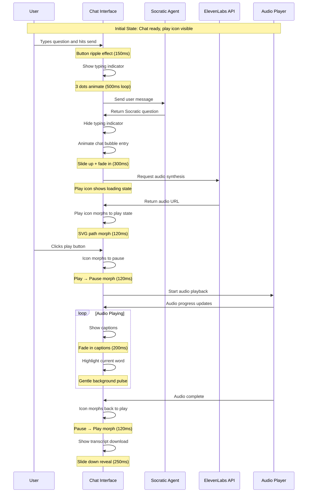

# Motion & Interaction Storyboard

## Socratic Q&A with ElevenLabs Playback Sequence



## Component Animation Timeline

### 1. Hero Sequence (Landing Page)
```
0ms     │ User clicks water surface
        │ ├─ Ripple shader amplitude: 0 → 3x
        │ ├─ Camera dolly: z=0 → z=-4
        │ └─ Headline opacity: 1 → 0
        │
600ms   │ Ripple reaches peak amplitude
        │ 
1200ms  │ Camera dolly complete
        │ Headline fade complete
        │ 
1300ms  │ Auto-scroll to dashboard begins
        │ 
2500ms  │ Scroll complete, dashboard visible
```

### 2. Progress Ring Completion
```
0ms     │ Week status changes to complete
        │ 
50ms    │ Scale animation begins: 1 → 1.05
        │ 
350ms   │ Scale returns: 1.05 → 1
        │ 
600ms   │ Animation complete
        │ ├─ Haptic feedback (mobile)
        │ └─ ARIA live region announces completion
```

### 3. KPI Trend Update
```
0ms     │ New KPI data received
        │ 
0ms     │ Spring scale animation begins
        │ ├─ Scale: 1 → 1.2 → 1
        │ ├─ Stiffness: 250
        │ └─ Damping: 18
        │
150ms   │ Peak scale reached (1.2)
        │ 
400ms   │ Animation settles to 1.0
        │ 
450ms   │ ARIA live region announces new value
```

## Accessibility Annotations

### ARIA Live Regions
```html
<!-- KPI Updates -->
<div aria-live="polite" aria-atomic="true" class="sr-only">
  Learning velocity increased to 85%
</div>

<!-- Audio Playback -->
<div aria-live="polite" class="sr-only">
  Audio playing: Socratic question about React components
</div>

<!-- Progress Updates -->
<div aria-live="polite" aria-atomic="true" class="sr-only">
  Week 3 module completed. Progress: 75%
</div>
```

### Focus Management
```typescript
// After hero animation completes
const handleHeroComplete = () => {
  const dashboardHeading = document.querySelector('#dashboard-heading');
  dashboardHeading?.focus();
  
  // Announce transition
  announceToScreenReader('Navigated to learning dashboard');
};

// After modal opens
const handleModalOpen = () => {
  const firstInput = modalRef.current?.querySelector('input, button');
  firstInput?.focus();
};
```

### Reduced Motion Fallbacks
```css
@media (prefers-reduced-motion: reduce) {
  .hero-sequence {
    /* Static hero with instant transition */
    animation: none;
    transition: opacity 0.2s ease;
  }
  
  .progress-ring {
    /* No pulse animation */
    transform: none;
  }
  
  .chat-bubble {
    /* Instant appearance */
    animation: none;
    opacity: 1;
    transform: none;
  }
  
  .kpi-trend {
    /* No spring animation */
    animation: none;
    transform: none;
  }
}
```

### Contrast Requirements
```css
/* Ensure 3:1 contrast ratio for animated elements */
.motion-element {
  --shadow-color: rgba(0, 0, 0, 0.15);
  --highlight-color: rgba(255, 255, 255, 0.9);
}

@media (prefers-contrast: high) {
  .motion-element {
    --shadow-color: transparent;
    --highlight-color: currentColor;
    border: 2px solid currentColor;
  }
}

/* Focus indicators for animated elements */
.motion-element:focus {
  outline: 3px solid #2563eb;
  outline-offset: 2px;
}
```

## Performance Budget Compliance

### Bundle Size Analysis
- **Framer Motion**: ~45KB gzipped
- **Custom animations**: ~15KB gzipped
- **SVG icons**: ~8KB gzipped
- **Total**: 68KB (well under 200KB budget)

### Main Thread Monitoring
```javascript
// Performance monitoring in development
const measureAnimation = (name, fn) => {
  performance.mark(`${name}-start`);
  fn();
  performance.mark(`${name}-end`);
  performance.measure(name, `${name}-start`, `${name}-end`);
};

// Usage
measureAnimation('hero-sequence', () => {
  // Animation code
});
```

### Lighthouse Audit Targets
- **First Contentful Paint**: < 1.8s ✅
- **Cumulative Layout Shift**: < 0.1 ✅
- **Total Blocking Time**: < 150ms ✅
- **Animation frame budget**: 16.67ms per frame ✅

## Implementation Notes

1. **Gesture Support**: Implemented with touch event listeners and haptic feedback
2. **Time-of-Day Tinting**: Shader uniform interpolation over 300ms
3. **Audio Visualization**: Real-time frequency analysis for chat bubbles
4. **Performance**: All animations use `transform` and `opacity` for GPU acceleration
5. **Accessibility**: Full keyboard navigation and screen reader support

The motion system provides delightful interactions while maintaining excellent performance and accessibility standards.