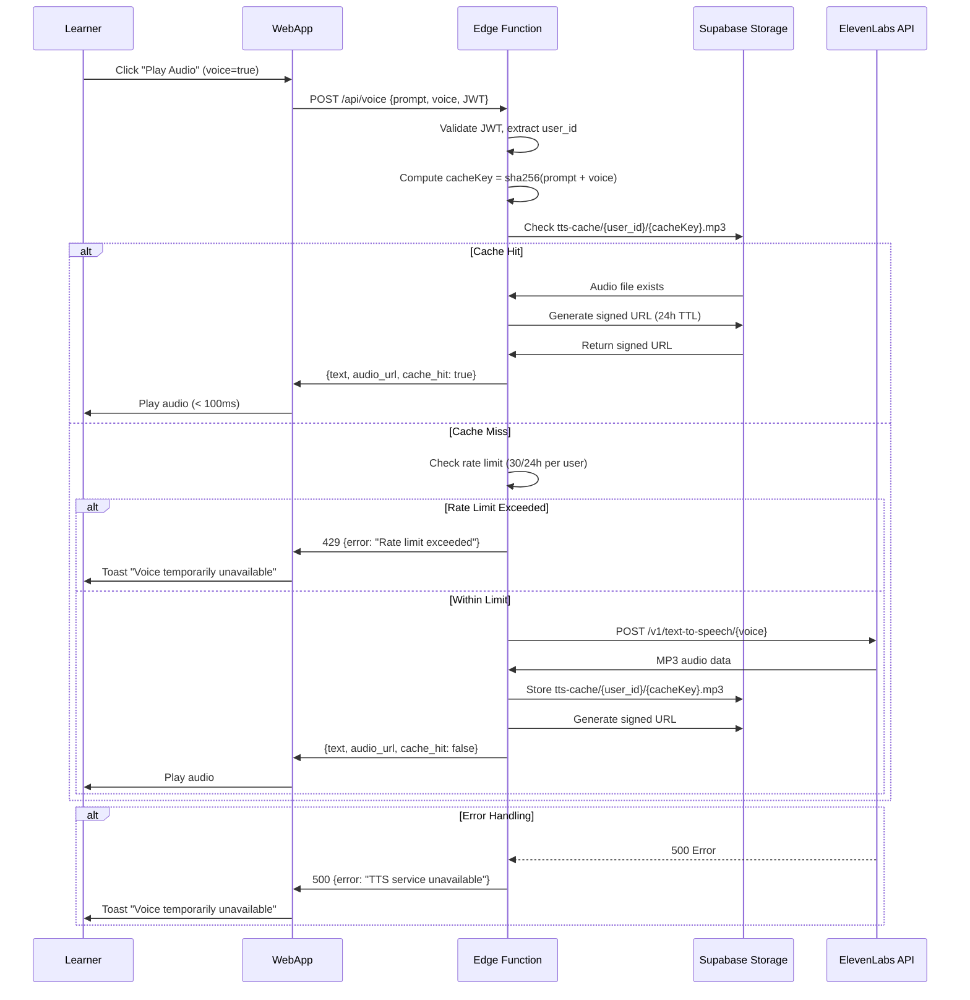

# TTS Integration Sequence Diagram

```mermaid
sequenceDiagram
    participant L as Learner
    participant W as WebApp
    participant E as Edge Function
    participant S as Supabase Storage
    participant EL as ElevenLabs API

    L->>W: Click "Play Audio" (voice=true)
    W->>E: POST /api/voice {prompt, voice, JWT}
    E->>E: Validate JWT, extract user_id
    E->>E: Compute cacheKey = sha256(prompt + voice)
    E->>S: Check tts-cache/{user_id}/{cacheKey}.mp3
    
    alt Cache Hit
        S->>E: Audio file exists
        E->>S: Generate signed URL (24h TTL)
        S->>E: Return signed URL
        E->>W: {text, audio_url, cache_hit: true}
        W->>L: Play audio (< 100ms)
    else Cache Miss
        E->>E: Check rate limit (30/24h per user)
        alt Rate Limit Exceeded
            E->>W: 429 {error: "Rate limit exceeded"}
            W->>L: Toast "Voice temporarily unavailable"
        else Within Limit
            E->>EL: POST /v1/text-to-speech/{voice}
            EL->>E: MP3 audio data
            E->>S: Store tts-cache/{user_id}/{cacheKey}.mp3
            E->>S: Generate signed URL
            E->>W: {text, audio_url, cache_hit: false}
            W->>L: Play audio
        end
    end
    
    alt Error Handling
        EL-->>E: 500 Error
        E->>W: 500 {error: "TTS service unavailable"}
        W->>L: Toast "Voice temporarily unavailable"
    end
```