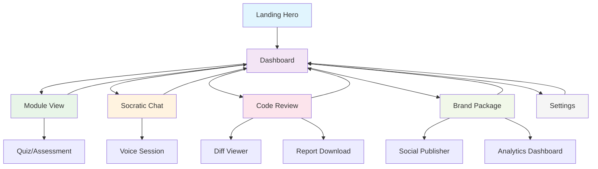

# Wisely UX Design System

## Overview
Complete UX design system implementing the Ripple-of-Knowledge visual language with responsive, production-ready layouts and component APIs.

## Design Principles
- **Ripple Effect**: Knowledge spreads like ripples in water
- **Fluid Motion**: Smooth, organic transitions
- **Glass Morphism**: Translucent depth and clarity
- **Progressive Disclosure**: Information reveals naturally

---

## 1. WIREFRAMES & LAYOUTS

### 1.1 Landing Hero
```
┌─────────────────────────────────────────────────────────┐
│                 WebGL Water Background                   │
│                                                         │
│              🧠 Wisely                    │
│               Ripple of Knowledge                       │
│                                                         │
│    Experience the future of learning with our          │
│           multi-agent AI platform                      │
│                                                         │
│              [Begin Your Ripple]                       │
│                                                         │
│           Click the water to start →                   │
└─────────────────────────────────────────────────────────┘
```

**Responsive Breakpoints:**
- Desktop (1440px+): Full viewport hero
- Tablet (768-1439px): Reduced text size, maintained proportions
- Mobile (360-767px): Stacked layout, larger touch targets

### 1.2 Dashboard
```
┌─────────────────────────────────────────────────────────┐
│ Header: Logo | Progress Ring (65%) | User Menu          │
├─────────────────────────────────────────────────────────┤
│                                                         │
│ ┌─────────────┐  ┌─────────────────────────────────────┐ │
│ │ Week 3      │  │ Latest KPIs                         │ │
│ │ Progress    │  │ • Learning Velocity: +15%           │ │
│ │ Ring (65%)  │  │ • Code Quality: 8.5/10              │ │
│ │             │  │ • Brand Authority: 750 pts          │ │
│ │[Begin Week] │  └─────────────────────────────────────┘ │
│ └─────────────┘                                         │
│                                                         │
│ Agent Status Cards (2x2 Grid)                          │
│ ┌─────────────┐ ┌─────────────┐                        │
│ │ CLO         │ │ Socratic    │                        │
│ │ 🎓 Ready    │ │ 💬 Active   │                        │
│ │ [Start]     │ │ [Continue]  │                        │
│ └─────────────┘ └─────────────┘                        │
│ ┌─────────────┐ ┌─────────────┐                        │
│ │ Alex        │ │ Brand       │                        │
│ │ 💻 Pending  │ │ 📈 Complete │                        │
│ │ [Review]    │ │ [View]      │                        │
│ └─────────────┘ └─────────────┘                        │
└─────────────────────────────────────────────────────────┘
```

### 1.3 Module View (CLO)
```
┌─────────────────────────────────────────────────────────┐
│ ← Back to Dashboard                    Week 3 Module    │
├─────────────────────────────────────────────────────────┤
│                                                         │
│ # Advanced React Patterns                               │
│ Estimated Duration: 4 hours                             │
│                                                         │
│ ▼ Learning Objectives                                   │
│   • Master compound components                          │
│   • Implement render props                              │
│   • Build custom hooks                                  │
│                                                         │
│ ▼ Key Concepts                                          │
│   • Component composition                               │
│   • State management patterns                           │
│   • Performance optimization                            │
│                                                         │
│ ▼ Resources                                             │
│   📖 React Docs: Advanced Patterns                     │
│   🎥 Video: Custom Hooks Deep Dive                     │
│   💻 Exercise: Build a Data Fetcher                    │
│                                                         │
│ ▼ Assessment                                            │
│   [Spaced Repetition Quiz] [Mark Complete]             │
└─────────────────────────────────────────────────────────┘
```

### 1.4 Socratic Chat
```
Desktop Layout:
┌─────────────────────────────────────────────────────────┐
│ Socratic Dialogue Session                               │
├─────────────────────────────────┬───────────────────────┤
│ Message History                 │ Audio Controls        │
│                                 │                       │
│ 💬 You: I'm learning React...   │ 🎵 Current Question   │
│                                 │ ┌─────────────────┐   │
│ 🤖 Socratic: What do you think │ │ ▶️ Play Audio    │   │
│    makes a component reusable?  │ │ 🎤 Voice Reply   │   │
│                                 │ │ 📝 Transcript    │   │
│ 💬 You: Probably props and...   │ └─────────────────┘   │
│                                 │                       │
│ 🤖 Socratic: Interesting. How  │ Voice Settings        │
│    would you test that theory?  │ • Speed: 1.0x         │
│                                 │ • Voice: Alloy        │
│ ┌─────────────────────────────┐ │ • Captions: On        │
│ │ Type your response...       │ │                       │
│ │                      [Send] │ │                       │
│ └─────────────────────────────┘ │                       │
├─────────────────────────────────┴───────────────────────┤
│ Session Progress: 12 questions • 45 min elapsed        │
└─────────────────────────────────────────────────────────┘

Mobile Layout (Stacked):
┌─────────────────────────────────┐
│ Socratic Dialogue               │
├─────────────────────────────────┤
│ 💬 You: I'm learning React...   │
│                                 │
│ 🤖 Socratic: What do you think │
│    makes a component reusable?  │
│ [▶️ Play] [📝 Transcript]       │
│                                 │
│ 💬 You: Probably props and...   │
│                                 │
│ ┌─────────────────────────────┐ │
│ │ Type response...      [🎤] │ │
│ └─────────────────────────────┘ │
└─────────────────────────────────┘
```

### 1.5 Code Review (Alex)
```
┌─────────────────────────────────────────────────────────┐
│ Code Review with Alex                                   │
├─────────────────────────────────────────────────────────┤
│ Repository Analysis                                     │
│                                                         │
│ Repository URL: [github.com/user/repo            ] 🔗  │
│ Analysis Depth: [STANDARD ▼]                           │
│ Branch: [main ▼]                                       │
│                                                         │
│ [🔍 Analyze Repository]                                │
│                                                         │
│ ┌─────────────────────────────────────────────────────┐ │
│ │ Analysis Results                                    │ │
│ │                                                     │ │
│ │ Overall Score: 8.5/10 ⭐                           │ │
│ │                                                     │ │
│ │ 📊 Code Quality Metrics                            │ │
│ │ • Maintainability: 9/10                            │ │
│ │ • Performance: 7/10                                │ │
│ │ • Security: 9/10                                   │ │
│ │ • Test Coverage: 85%                               │ │
│ │                                                     │ │
│ │ 🔧 Key Recommendations                             │ │
│ │ 1. Optimize bundle size (-23%)                     │ │
│ │ 2. Add error boundaries                            │ │
│ │ 3. Implement lazy loading                          │ │
│ │                                                     │ │
│ │ 📁 File-by-File Analysis                           │ │
│ │ ▼ src/components/Dashboard.tsx                     │ │
│ │   ⚠️  Large component (200+ lines)                │ │
│ │   💡 Consider splitting into smaller components   │ │
│ │                                                     │ │
│ │ [📥 Download Report] [🔄 Re-analyze]              │ │
│ └─────────────────────────────────────────────────────┘ │
└─────────────────────────────────────────────────────────┘
```

### 1.6 Brand Package
```
┌─────────────────────────────────────────────────────────┐
│ Personal Brand Strategy Package                         │
├─────────────────────────────────────────────────────────┤
│                                                         │
│ 📈 Brand Authority Score: 750 pts (+50 this week)      │
│                                                         │
│ Social Content Ready to Publish                        │
│ ┌─────────────┐ ┌─────────────┐ ┌─────────────┐        │
│ │ LinkedIn    │ │ Twitter/X   │ │ Blog Post   │        │
│ │ 📝 Post     │ │ 🐦 Thread   │ │ 📖 Article  │        │
│ │             │ │             │ │             │        │
│ │ "Just built │ │ "🧵 Thread  │ │ "Deep Dive: │        │
│ │ an amazing  │ │ on React    │ │ Advanced    │        │
│ │ React hook  │ │ patterns... │ │ React..."   │        │
│ │ for..."     │ │             │ │             │        │
│ │             │ │ Est: 45     │ │ Est: 120    │        │
│ │ Est: 25     │ │ likes       │ │ views       │        │
│ │ likes       │ │             │ │             │        │
│ │             │ │ [📋 Copy]   │ │ [📋 Copy]   │        │
│ │ [📋 Copy]   │ │ [🚀 Post]   │ │ [🚀 Post]   │        │
│ │ [🚀 Post]   │ └─────────────┘ └─────────────┘        │
│ └─────────────┘                                        │
│                                                         │
│ 📊 Performance Metrics                                  │
│ ┌─────────────────────────────────────────────────────┐ │
│ │ Metric          │ Current │ Target  │ Trend         │ │
│ │ Followers       │ 1,247   │ 1,500   │ ↗️ +12%      │ │
│ │ Engagement Rate │ 4.2%    │ 5.0%    │ ↗️ +0.8%     │ │
│ │ Authority Score │ 750     │ 800     │ ↗️ +50       │ │
│ │ Content Views   │ 12.5K   │ 15K     │ ↗️ +2.1K     │ │
│ └─────────────────────────────────────────────────────┘ │
│                                                         │
│ [📄 Download Portfolio PDF] [📊 Full Analytics]        │
└─────────────────────────────────────────────────────────┘
```

### 1.7 Settings
```
┌─────────────────────────────────────────────────────────┐
│ Settings & Preferences                                  │
├─────────────────────────────────────────────────────────┤
│                                                         │
│ 👤 Profile Information                                  │
│ Name: [John Doe                    ]                    │
│ Email: [john@example.com           ]                    │
│ Learning Focus: [Full-Stack Development ▼]             │
│                                                         │
│ 🎵 Voice & Audio                                        │
│ ElevenLabs Voice: [Alloy ▼]                            │
│ Audio Speed: [1.0x ▼]                                  │
│ Auto-play Responses: [✓] On                            │
│ Download Transcripts: [✓] On                           │
│                                                         │
│ 🎨 Visual Preferences                                   │
│ Theme: [🌙 Dark] [☀️ Light] [🔄 Auto]                  │
│ Water Tint: [🔵 Blue] [🟢 Teal] [🟣 Purple]           │
│ Reduced Motion: [✓] On                                 │
│ High Contrast: [ ] Off                                 │
│                                                         │
│ 🔔 Notifications                                        │
│ Weekly Reminders: [✓] On                               │
│ Progress Updates: [✓] On                               │
│ New Content: [ ] Off                                   │
│                                                         │
│ 📊 Data & Privacy                                       │
│ Export Learning Data: [📥 Download]                    │
│ Delete Account: [🗑️ Delete]                           │
│                                                         │
│ [💾 Save Changes] [🔄 Reset to Defaults]              │
└─────────────────────────────────────────────────────────┘
```

---

## 2. COMPONENT LIBRARY

### 2.1 Component Map

| Component | Path | Tokens Used | Pages Used |
|-----------|------|-------------|------------|
| `ProgressRing` | `src/components/ui/ProgressRing.tsx` | `color.primary.*`, `motion.duration.normal` | Dashboard, Module |
| `AgentCard` | `src/components/dashboard/AgentCard.tsx` | `color.glass.*`, `boxShadow.ripple-md` | Dashboard |
| `CollapsibleMarkdown` | `src/components/ui/CollapsibleMarkdown.tsx` | `borderRadius.2xl`, `spacing.*` | Module View |
| `ChatBubble` | `src/components/chat/ChatBubble.tsx` | `color.primary.*`, `borderRadius.2xl` | Socratic Chat |
| `VoiceControls` | `src/components/audio/VoiceControls.tsx` | `color.teal.*`, `motion.micro-interactions.*` | Socratic Chat |
| `DiffViewer` | `src/components/code/DiffViewer.tsx` | `fontFamily.mono`, `color.slate.*` | Code Review |
| `KPITrend` | `src/components/analytics/KPITrend.tsx` | `color.emerald.*`, `motion.duration.fast` | Dashboard, Brand |
| `SocialCard` | `src/components/brand/SocialCard.tsx` | `color.glass.*`, `boxShadow.glass` | Brand Package |
| `GlassCard` | `src/components/ui/GlassCard.tsx` | `color.glass.*`, `backdropBlur.md` | All pages |
| `RippleButton` | `src/components/ui/RippleButton.tsx` | `motion.micro-interactions.ripple-click` | All pages |

### 2.2 Component APIs

#### ProgressRing
```typescript
interface ProgressRingProps {
  progress: number; // 0-100
  size?: 'sm' | 'md' | 'lg'; // 40px, 60px, 80px
  strokeWidth?: number; // 2-8
  color?: 'primary' | 'emerald' | 'amber';
  showLabel?: boolean;
  animated?: boolean;
  className?: string;
}
```

#### AgentCard
```typescript
interface AgentCardProps {
  agent: {
    name: string;
    status: 'idle' | 'active' | 'complete' | 'error';
    progress: number;
    lastActivity: string;
    icon: React.ComponentType;
  };
  onInteract: () => void;
  variant?: 'default' | 'compact';
  className?: string;
}
```

#### ChatBubble
```typescript
interface ChatBubbleProps {
  message: {
    id: string;
    content: string;
    sender: 'user' | 'agent';
    timestamp: Date;
    audioUrl?: string;
    hasTranscript?: boolean;
  };
  onPlayAudio?: (url: string) => void;
  onShowTranscript?: (id: string) => void;
  variant?: 'default' | 'compact';
}
```

#### VoiceControls
```typescript
interface VoiceControlsProps {
  isRecording: boolean;
  isPlaying: boolean;
  audioUrl?: string;
  onStartRecording: () => void;
  onStopRecording: () => void;
  onPlayAudio: () => void;
  onPauseAudio: () => void;
  showTranscript?: boolean;
  onToggleTranscript?: () => void;
}
```

#### KPITrend
```typescript
interface KPITrendProps {
  metric: {
    name: string;
    current: number;
    target: number;
    trend: 'up' | 'down' | 'stable';
    change: number;
    unit: string;
  };
  variant?: 'default' | 'compact' | 'detailed';
  showSparkline?: boolean;
}
```

#### SocialCard
```typescript
interface SocialCardProps {
  platform: 'linkedin' | 'twitter' | 'blog';
  content: {
    title: string;
    body: string;
    estimatedEngagement: number;
    tags?: string[];
  };
  onCopy: () => void;
  onPublish: () => void;
  variant?: 'preview' | 'edit';
}
```

---

## 3. NAVIGATION FLOW



---

## 4. ACCESSIBILITY ANNOTATIONS

### 4.1 ARIA Roles & Labels
```html
<!-- Progress Ring -->
<div role="progressbar" 
     aria-valuenow="65" 
     aria-valuemin="0" 
     aria-valuemax="100"
     aria-label="Learning progress: 65% complete">

<!-- Agent Cards -->
<article role="article" aria-labelledby="agent-clo-title">
  <h3 id="agent-clo-title">CLO - Curriculum Architect</h3>
  <button aria-describedby="agent-clo-status">Start Session</button>
  <div id="agent-clo-status">Status: Ready to begin</div>
</article>

<!-- Chat Interface -->
<main role="main" aria-label="Socratic dialogue session">
  <section role="log" aria-live="polite" aria-label="Conversation history">
    <div role="article" aria-label="Message from Socratic agent">
  </section>
  <form role="form" aria-label="Send message">
    <input aria-label="Type your response" />
    <button type="submit">Send message</button>
  </form>
</main>

<!-- Voice Controls -->
<button aria-pressed="false" 
        aria-label="Start voice recording"
        aria-describedby="voice-status">
  🎤
</button>
<div id="voice-status" aria-live="polite">Ready to record</div>
```

### 4.2 Keyboard Navigation
```
Tab Order:
1. Skip to main content
2. Navigation menu
3. Primary actions (Begin Week, Start Session)
4. Secondary actions (Settings, Profile)
5. Content interactions (Expand/Collapse, Play/Pause)
6. Form inputs (in logical order)

Keyboard Shortcuts:
- Space/Enter: Activate buttons
- Arrow keys: Navigate between related items
- Esc: Close modals/overlays
- Tab/Shift+Tab: Navigate focus
- Home/End: Jump to start/end of lists
```

### 4.3 Focus Management
```css
/* Visible focus indicators */
.focus-visible {
  outline: 2px solid var(--color-primary-500);
  outline-offset: 2px;
  border-radius: 4px;
}

/* High contrast mode support */
@media (prefers-contrast: high) {
  .focus-visible {
    outline: 3px solid;
    outline-color: Highlight;
  }
}

/* Reduced motion support */
@media (prefers-reduced-motion: reduce) {
  .ripple-animation {
    animation: none;
    transition: opacity 0.2s ease;
  }
}
```

---

## 5. MOBILE BREAKPOINTS

### 5.1 Grid Specifications

```css
/* Mobile First (360px+) */
.container {
  padding: 1rem;
  max-width: 100%;
}

.grid-mobile {
  display: grid;
  grid-template-columns: 1fr;
  gap: 1rem;
}

/* Tablet (768px+) */
@media (min-width: 768px) {
  .container {
    padding: 1.5rem;
    max-width: 768px;
    margin: 0 auto;
  }
  
  .grid-tablet {
    grid-template-columns: repeat(2, 1fr);
    gap: 1.5rem;
  }
}

/* Desktop (1024px+) */
@media (min-width: 1024px) {
  .container {
    padding: 2rem;
    max-width: 1200px;
  }
  
  .grid-desktop {
    grid-template-columns: repeat(3, 1fr);
    gap: 2rem;
  }
}

/* Large Desktop (1440px+) */
@media (min-width: 1440px) {
  .container {
    max-width: 1400px;
  }
  
  .grid-large {
    grid-template-columns: repeat(4, 1fr);
    gap: 2.5rem;
  }
}
```

### 5.2 Touch Targets
```css
/* Minimum 44px touch targets */
.touch-target {
  min-height: 44px;
  min-width: 44px;
  padding: 0.75rem;
}

/* Increased spacing on mobile */
@media (max-width: 767px) {
  .button-group {
    gap: 1rem;
  }
  
  .form-field {
    margin-bottom: 1.5rem;
  }
}
```

---

## 6. PERFORMANCE TARGETS

### 6.1 Core Web Vitals
- **LCP (Largest Contentful Paint)**: < 1.8s
- **CLS (Cumulative Layout Shift)**: < 0.1
- **TBT (Total Blocking Time)**: < 150ms

### 6.2 Optimization Strategies
```typescript
// Lazy loading for heavy components
const CodeReview = lazy(() => import('./pages/CodeReview'));
const BrandPackage = lazy(() => import('./pages/BrandPackage'));

// Image optimization
const OptimizedImage = ({ src, alt, ...props }) => (
  
);

// Bundle splitting
const router = createBrowserRouter([
  {
    path: "/",
    element: <Dashboard />,
    children: [
      {
        path: "module",
        element: <Suspense fallback={<Spinner />}><ModuleView /></Suspense>
      }
    ]
  }
]);
```

---

## 7. IMPLEMENTATION CHECKLIST

### Phase 1: Foundation
- [ ] Set up design tokens
- [ ] Create base components (GlassCard, RippleButton)
- [ ] Implement responsive grid system
- [ ] Add accessibility utilities

### Phase 2: Core Pages
- [ ] Landing hero with WebGL water
- [ ] Dashboard with agent cards
- [ ] Basic navigation flow

### Phase 3: Agent Interfaces
- [ ] Module view with collapsible sections
- [ ] Socratic chat with voice controls
- [ ] Code review with diff viewer

### Phase 4: Brand Features
- [ ] Social content cards
- [ ] KPI dashboard
- [ ] Analytics integration

### Phase 5: Polish
- [ ] Settings page
- [ ] Performance optimization
- [ ] Accessibility audit
- [ ] Cross-browser testing

---

This comprehensive UX design system provides the foundation for building a production-ready Wisely platform that embodies the Ripple-of-Knowledge visual language while maintaining excellent accessibility and performance standards.